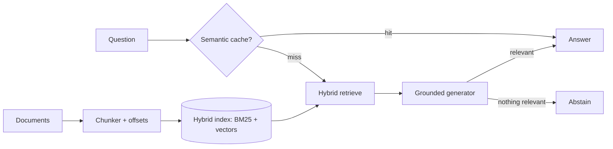

# DocSage


**Grounded document Q&A with citations — a production-shaped RAG pipeline in Python.**

DocSage answers natural-language questions using *only* the documents you give it, always attaches citations, and **abstains instead of hallucinating** when the answer isn't in the corpus. It runs completely offline with **zero API keys** (dependency-free local embeddings + extractive answering) and automatically upgrades to OpenAI embeddings + LLM generation when `OPENAI_API_KEY` is set. It ships as one container for **AWS ECS/Fargate**.

> Why it exists: a venue/e-commerce business has policies, FAQs, and guides scattered across documents. Support staff and customers need instant, trustworthy answers. DocSage grounds every answer in the source text with citations, so nobody gets a confidently-wrong reply.

---

## What makes it interesting

- **Hybrid retrieval** (`app/core/retrieval.py`): BM25 lexical scoring *and* vector similarity, fused with a tunable weight. Neither alone is enough — BM25 nails exact terms, vectors capture paraphrase — and the UI lets you slide between them live.
- **Abstention over hallucination**: results below a relevance floor are dropped and the system explicitly says "I couldn't find an answer." This is the single most important property of a trustworthy RAG system.
- **Citations with provenance**: chunking tracks each chunk's source document and character span, so every answer links back to where it came from.
- **Semantic cache** (`app/core/engine.py`): near-duplicate questions (by embedding cosine similarity) return instantly, cutting latency and LLM cost.
- **Pluggable backends behind one interface**: local (no deps) ↔ OpenAI, swappable without touching the pipeline — the clean seam of a well-designed system.
- **Tested**: retrieval-with-citation, correct abstention, chunk offsets, and cache hits — all runnable with no external services.

## Architecture



## Quick start

```bash
docker compose up --build
```

Open http://localhost:8000. Two documents (refund policy + venue guide) are pre-loaded. Try:

- "How long do refunds take if an event is cancelled?" → answered with a citation
- "How much is parking?" → answered from the *other* document
- "What is the capital of France?" → **abstains** (not in the docs)

Slide the retrieval control between lexical and semantic and re-ask to see the difference.

## Enable OpenAI (optional)

```bash
export OPENAI_API_KEY=sk-...
pip install openai
```

DocSage detects the key and switches to `text-embedding-3-small` + `gpt-4o-mini`, with the LLM strictly constrained to the retrieved context.

## API

| Method | Path | Description |
|--------|------|-------------|
| `POST` | `/api/documents` | `{doc_id, text}` — chunk & index a document |
| `GET`  | `/api/documents` | List indexed documents |
| `POST` | `/api/ask` | `{query, top_k, alpha}` — grounded answer with citations |
| `GET`  | `/api/stats` | Pipeline stats + active backends |

## Run locally without Docker

```bash
python3 -m venv .venv && source .venv/bin/activate
pip install -r requirements.txt
uvicorn app.main:app --reload
```

## Tests

```bash
pip install pytest
pytest
```

## Development

Common tasks are wrapped in a `Makefile` (`make help` lists everything):

```bash
make install          # create venv + install deps (+ pytest)
make test             # run tests
make run              # run the FastAPI server (reload)
make frontend-dev     # Vite dev server for the React/TS frontend
make up               # docker compose up --build
```

## Deploying to AWS ECS/Fargate

1. Push the image to ECR.
2. Run a Fargate service exposing `:8000` behind an ALB.
3. Store `OPENAI_API_KEY` in AWS Secrets Manager and inject it as an environment variable if you want LLM-quality answers.
4. For a persistent corpus, mount EFS and load documents on startup, or add a vector DB (pgvector/Chroma) behind the same `Embedder` seam.

## Project layout

```
app/main.py           FastAPI app + routes + seeding
app/core/chunking.py  sentence-aware chunker with offsets
app/core/embeddings.py local + OpenAI embedders behind one interface
app/core/retrieval.py  hybrid BM25 + vector index with abstention floor
app/core/generation.py extractive + LLM generators, citations, abstention
app/core/engine.py     orchestration + semantic cache
web/index.html        modern chat UI (Tailwind CDN)
data/                 seed knowledge base
tests/                RAG core tests (no API key needed)
```

## License

MIT
